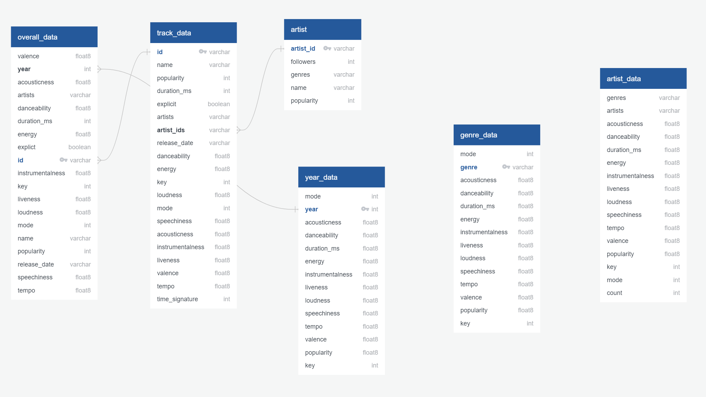

# Project Overview
Our project entails creating a music recommendation website using machine learning to analyze song and artist characteristics and make recommendations to users for additional songs.

Presentation Slides: https://docs.google.com/presentation/d/1fenD0qLnxMxOIn_bhs8PUaC3YdDqmv0f-JdH6nSpv7U/edit?usp=sharing
Storyboard Slides: https://docs.google.com/presentation/d/1UO--Mb5cc4-dj-lo2UrzN9U1MlOCjZQdRbD1l1JphEc/edit?usp=sharing

## Hypothesis and Goals
### Hypothesis
- Can machine learning predict what songs a user will enjoy based on the audio features of songs they like?
### Additional Questions Posed
- Can we predict an artist's most popular song based on audio elements?
- Can we predict the most popular song off an album based on audio elements?
- Can we use audio elements to predict a song a listener would like?
- Can we use audio elements of an artist to predict another artist a listener would like?

## Project Description
### Technologies Used
#### Data Cleaning and Analysis
Cleaning and analysing the data will be done using Pandas through Python in Jupyter Notebook. 

#### Database Storage
Our database will be stored and managed in SQL using Postgres. 

#### Machine Learning
Using the SciKitLearn Python library we will develop, test, and train our model. 
##### Description of How Data Will Be Split in Testing
Need to create our output and based on our magnitude of the song out put songs with a similar magnitude. We as a team will test to see if we like or dislike. We will similarly run that testing with random song selection to see if we like or dislike the song that was selected. Here we will compare the percentage of times we “liked” or “disliked” a song.
##### Explanation of Model Choice
We will  be using K- Nearest Neighbors. We want to pull songs of a similar magnitude based on the quantifiable characteristics  given by spotify. The idea is the magnitude that we give an individual song will place similar songs next to each other helping us to find songs that the user will like. The downfall of this is that a song could have vastly different traits but could end up having similar magnitudes.

#### Dashboard
We will investigate the potential for using Tableau to develop our interactive database or else use Flask to deploy our model through an interactive dashboard designed using Javascript D3 for a combination of HTML, Canvas, and SVG.
Heroku will be used for hosting. 

### Data Source
Our primary data source is the Kaggle dataset titled Spotify Dataset 1922-2021, ~600k Tracks which contains information and audio feature measurements fon tracks and artists obtained using the Spotify API.

